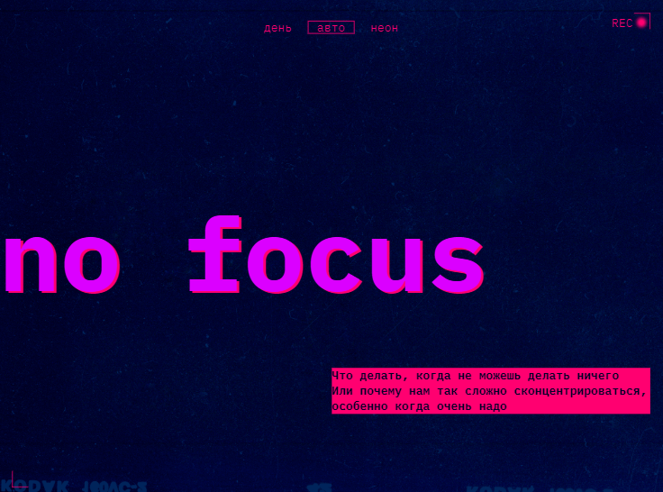
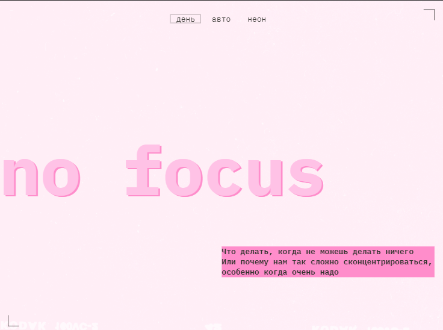
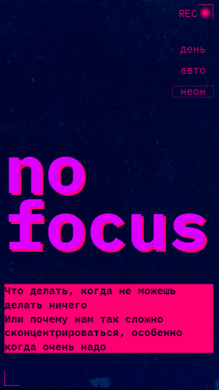
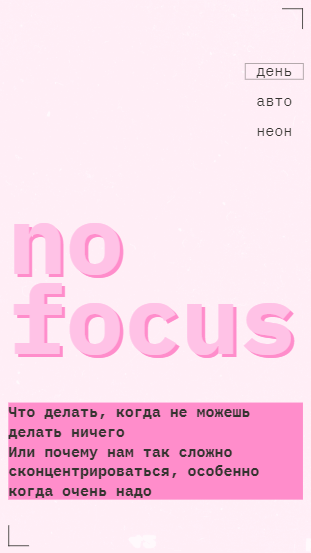

https://github.com/lev1996frontend/slozhno-sosredotochitsya.git

# Яндекс Практикум, проект "Сложно сосредоточиться"

## Оглавление
	- [Скриншоты](#скриншоты)
	- [Макет](#макет)
	- [Ссылки](#ссылки)
	- [Автор](#автор)

### Скриншоты

### Макет

- Макет задания: [Figma](https://www.figma.com/file/lCqDbWjgllgJtb2hmCqfyX/%236-Сложно-сосредоточиться?type=design&node-id=601-384&mode=design&t=lrlM9jRg1wsRgzLQ-0)

### Ссылки

- URL решения: [Github](https://github.com/lev1996frontend/slozhno-sosredotochitsya)
- URL лайв сервера: [Github](https://lev1996frontend.github.io/slozhno-sosredotochitsya/)

## Автор

- Github - [lev1996frontend](https://github.com/lev1996frontend)